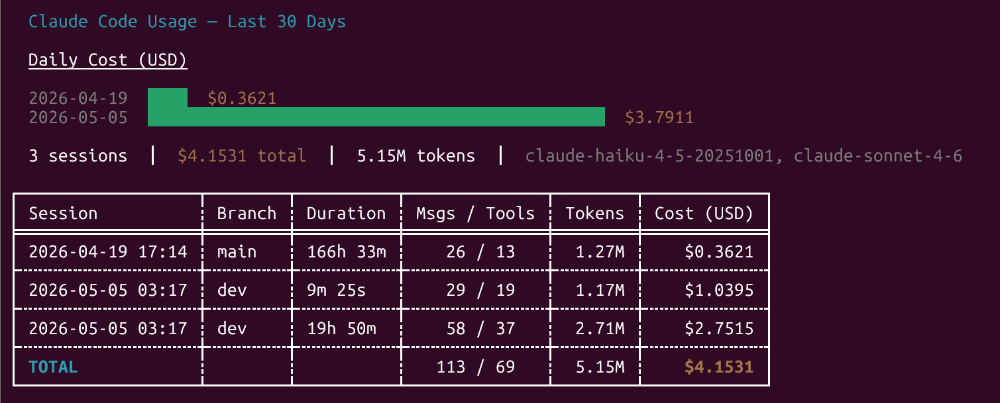

# claude-usage

_Yes, there's `/usage` but I wanted to try something different._

A terminal dashboard for Claude Code session statistics, powered by a `SessionEnd` hook that writes a local JSONL log.


## What it shows

- **Bar chart** — daily aggregated cost (or token) usage scaled to max, with green bars and yellow values
- **Summary line** — session count, total cost, total tokens, and models seen
- **Session table** — date/time, git branch, duration, message and tool-call counts, tokens, cost, plus a bold totals row



## How it works

```
Claude Code session ends
        │
        ▼
SessionEnd hook fires collect-session-stats.py
        │   reads transcript, tallies tokens + cost per model
        ▼
~/.claude/usage-log.jsonl  ←  one JSON record appended per session
        │
        ▼
claude-usage CLI reads the log and renders the dashboard
```

The Python hook uses only the standard library — no `pip install` needed.

## Setup

### 1. Install the hook (requires Python 3)

```sh
git clone https://github.com/your-username/claude-usage.git
cd claude-usage
make install-hook
```

This copies `hook/collect-session-stats.py` to `~/.claude/` and registers the `SessionEnd` hook in `~/.claude/settings.json`. Safe to run multiple times — will not create duplicate entries.

### 2. Install the CLI

**Option A — pre-built binary (no Rust required)**

Download the archive for your platform from the [Releases page](../../releases/latest), extract it, and place the binary somewhere on your `PATH` (e.g. `~/.local/bin/`):

| Platform | Archive |
|----------|---------|
| Linux / WSL | `claude-usage-linux-x86_64.tar.gz` |
| macOS (Intel + Apple Silicon) | `claude-usage-macos-universal.tar.gz` |
| Windows | `claude-usage-windows-x86_64.zip` |

**Option B — build from source (requires Rust / cargo)**

```sh
make install
```

Builds a release binary and copies it to `~/.local/bin/claude-usage`. Make sure `~/.local/bin` is on your `PATH`.

Or do both steps at once:

```sh
make install-all
```

### 3. Use it

Start (or finish) a Claude Code session to generate your first log entry, then:

```sh
claude-usage
```

## Usage

```sh
claude-usage                        # last 30 days, cost chart
claude-usage --days 7               # last 7 days
claude-usage --chart tokens         # token chart instead of cost
claude-usage --chart tokens --days 14
```

| Flag | Default | Description |
|------|---------|-------------|
| `-d`, `--days N` | `30` | How many days back to include |
| `--chart cost\|tokens` | `cost` | Metric shown in the bar chart |

## Development

```sh
make build    # debug build
make release  # optimized build (also used by install)
make run      # cargo run with default flags
make check    # fast compile check, no binary produced
make clean    # remove the target/ directory
```

## Keeping pricing current

The hook prices API usage using a table in `hook/collect-session-stats.py`. If Anthropic changes pricing, update `MODEL_PRICING` near the top of that file and re-run `make install-hook`.

Models not found in the table are tracked but marked as unpriced — the CLI will show a warning when this happens.

## Log format

Each line in `~/.claude/usage-log.jsonl` is a JSON object:

```json
{
  "session_id": "...",
  "recorded_at": "2026-05-05T12:00:00+00:00",
  "session_start": "2026-05-05T10:00:00Z",
  "session_end": "2026-05-05T11:00:00Z",
  "duration_ms": 3600000,
  "message_count": 42,
  "tool_call_count": 18,
  "git_branch": "main",
  "cwd": "/home/user/projects/myapp",
  "total_cost_usd": 0.2341,
  "models": {
    "claude-sonnet-4-6": {
      "input_tokens": 50000,
      "output_tokens": 8000,
      "cache_write_tokens": 12000,
      "cache_read_tokens": 30000,
      "cost_usd": 0.2341
    }
  },
  "unpriced_models": []
}
```
